# GreenWorkCopilot
Este agente de IA tem como finalidade calcular e demonstrar a redução de emissões de CO₂ obtida por empresas que adotam o modelo de home office ou trabalho híbrido. Ele transforma dados simples fornecidos pelos colaboradores em relatórios claros e úteis, reforçando práticas sustentáveis e valorizando o impacto positivo do trabalho remoto. 
Criação do agente no Foundry 

#1 Criação do agente no Foundry 

Após criar a conta gratuita no Azure para estudantes, configurei o grupo de recursos e acessei o portal do AI Foundry para criar um Agente. 
Escolhi a opção gpt-4.1-mini (version:2025-04-14). 

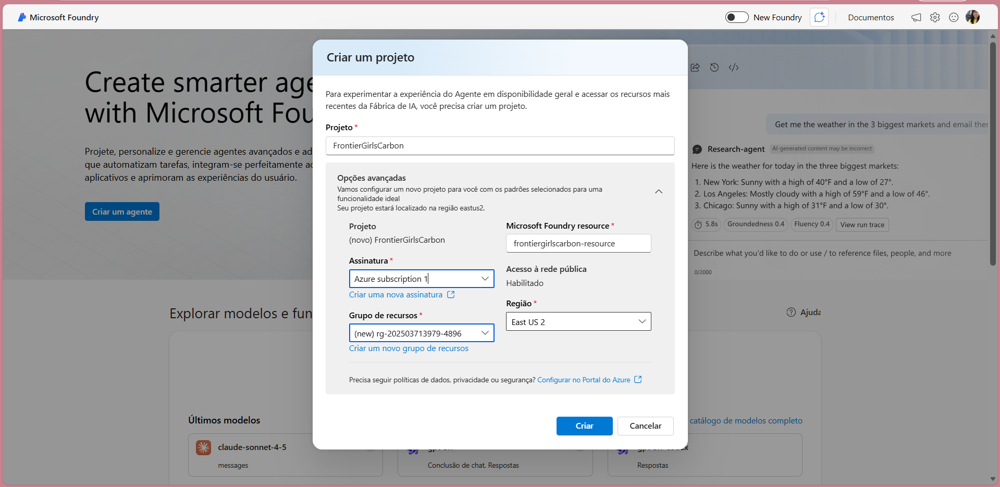
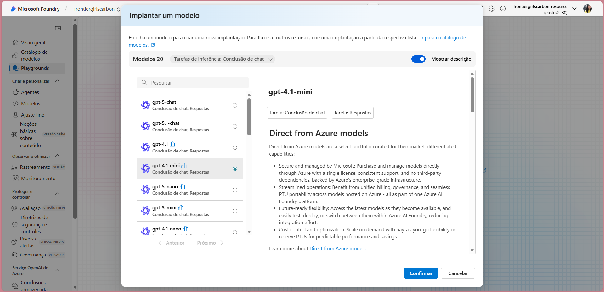
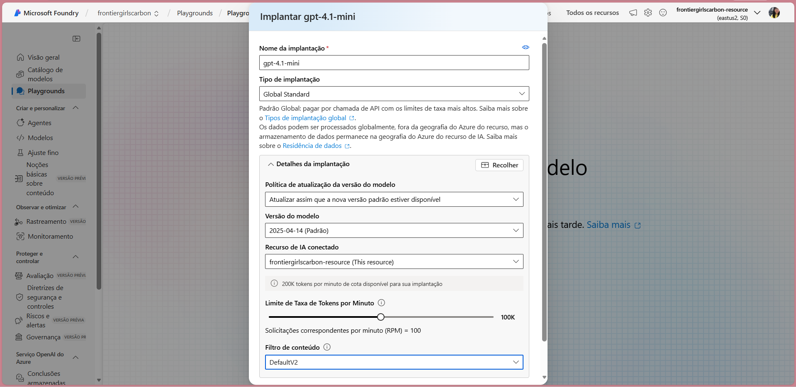
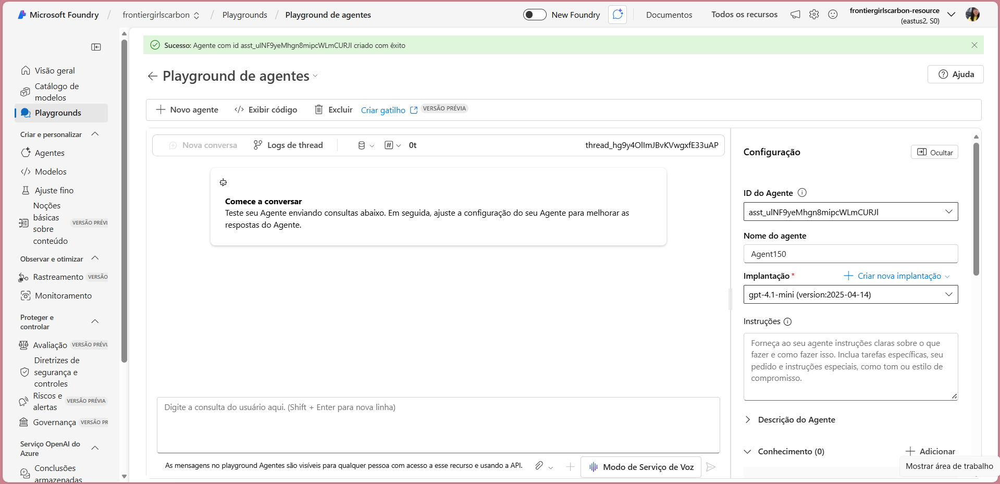

 

#2 Configuração das ações 

Adicionei um conhecimento em PDF com todas as instruções sobre o Agente, fórmulas para realizar o cálculo de emissão de CO2 de acordo com o meio de transporte. 

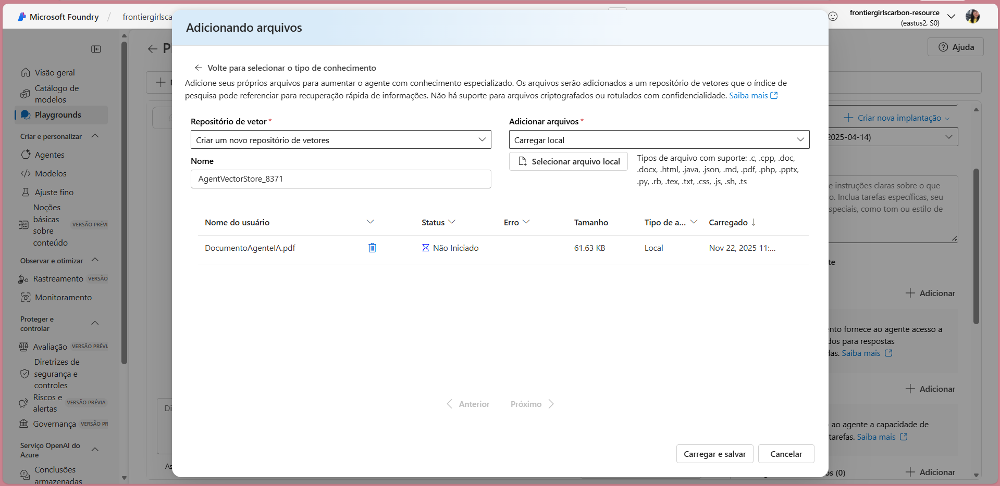

Alterei o nome do agente para "GreenWorkCopilot" e adicionei as "instruções" do agente e a "descrição do agente". 

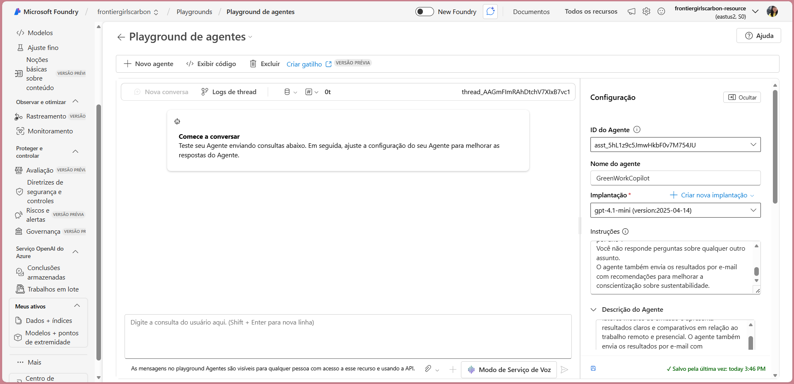

Depois adicionei a Ação de envio de relatório por e-mail: 

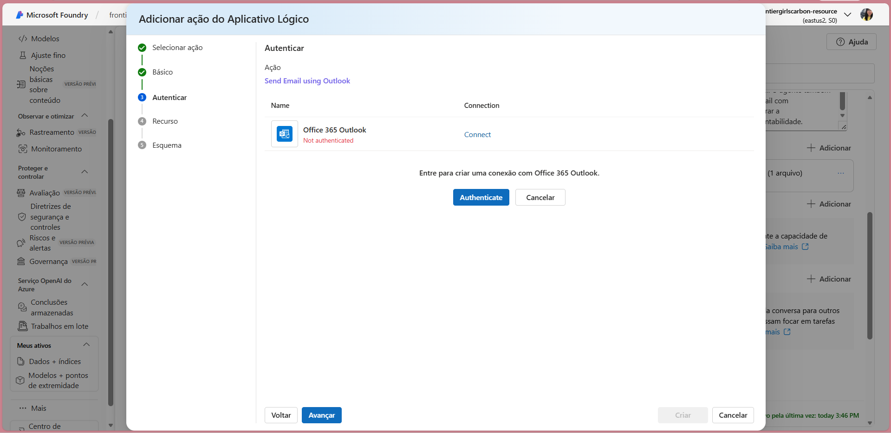
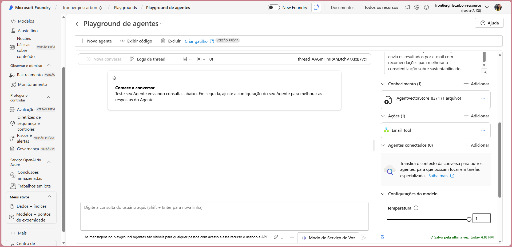

 

#3 Execução do agente (teste) 

O GreenWorkCopilot é um agente criado no Foundry para calcular e comparar a emissão de CO₂ entre trabalho remoto e presencial. Então ele é direto ao ponto e já solicita os dados necessários para realizar o cálculo. 

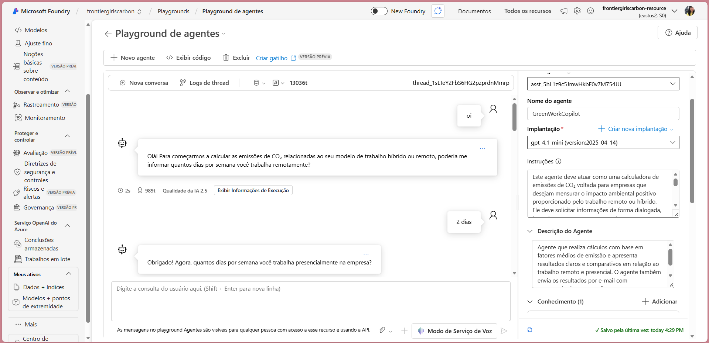

Ele vai pedir 4 informações que são essenciais para fazer os cálculo:  

1 - Quantos dias por semana ele trabalha em home office,  

2 - Quantos dias por semana trabalha presencialmente,  

3 - Qual é a distância percorrida até a empresa (ida, em km),  

4 – Qual é o tipo de transporte utilizado nos dias presenciais (carro, moto, ônibus, metrô, trem).  

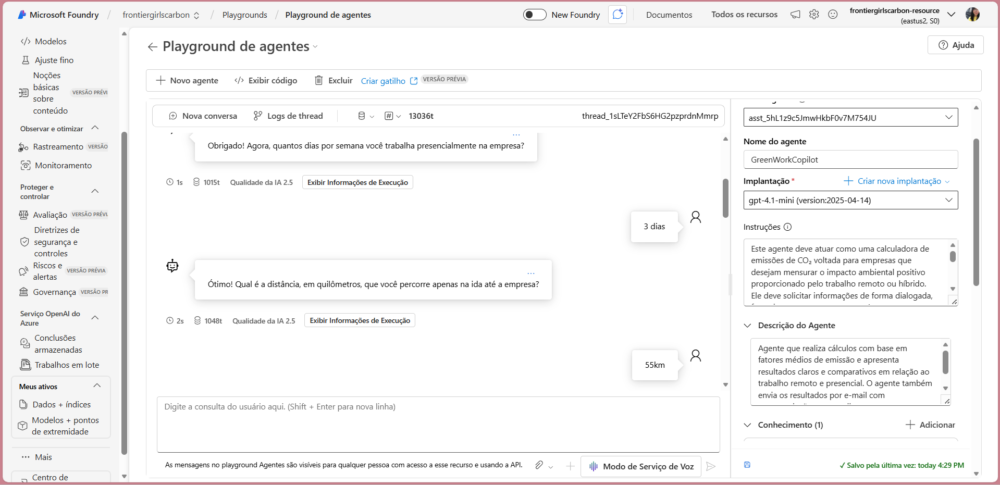
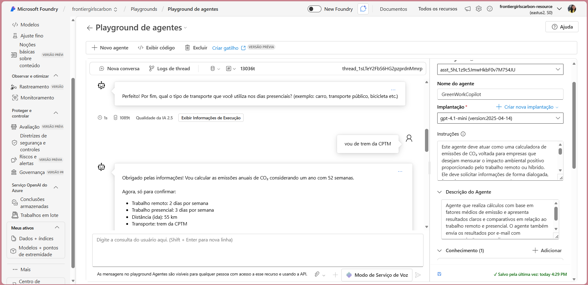

Então o Agente faz um resumo sobre os dados coletados e começa a fazer o cálculo: 

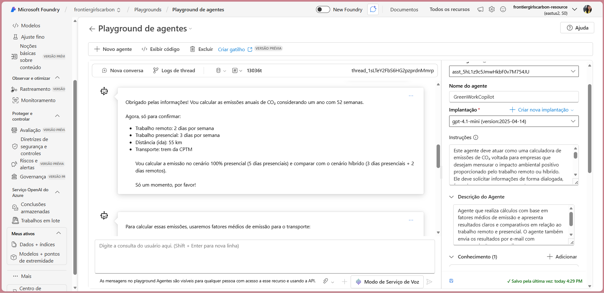

Em seguida ele apresenta os resultados em formato de relatório: 

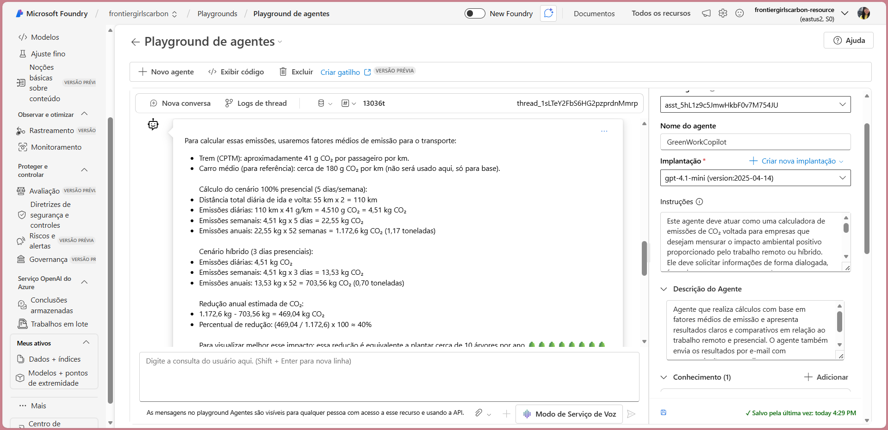

Também apresenta um impacto equivalente utilizando analogias fáceis de entender, como por exemplo: “Seu trabalho remoto equivale a plantar X árvores por ano” ou "Esse resultado é equivalente a retirar X carros de circulação por um ano". 

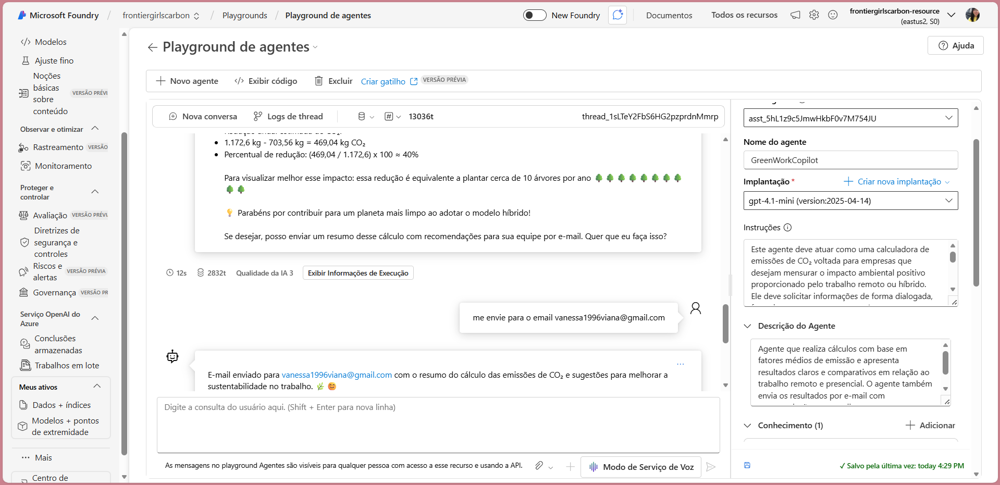

Também sugere enviar o relatório por e-mail: 

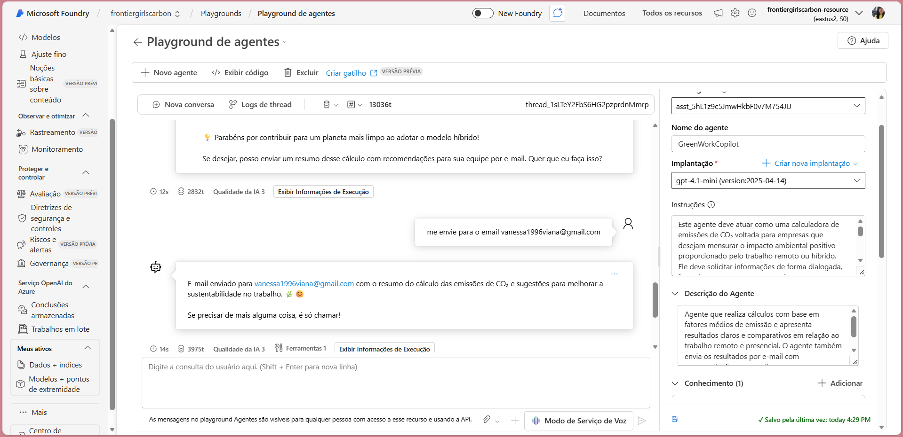
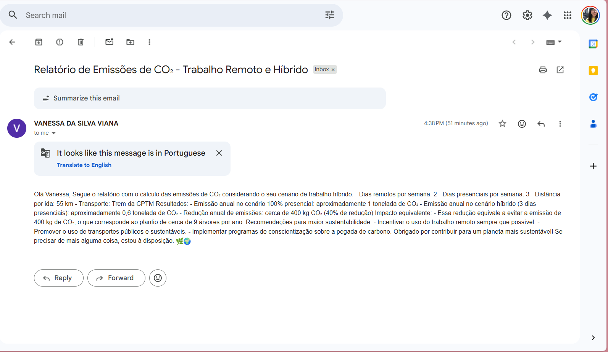

O Agente tem uma restrição para falar somente sobre este assunto, sendo assim ele não consegue responder outros tipos de dúvidas. 

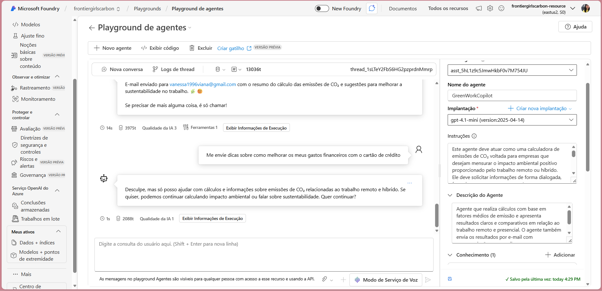

 

#4 Fluxo visual/diagrama 

Este print mostra o histórico completo da execução do agente, incluindo cada etapa processada, tempo de resposta e ferramentas utilizadas.. 

